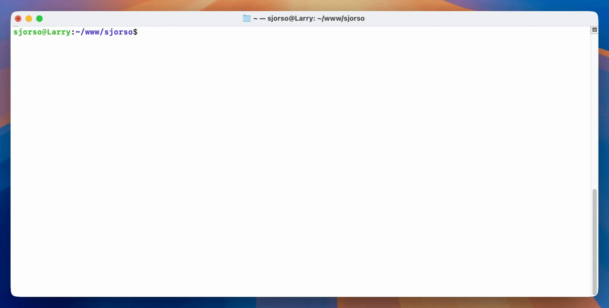

<p align="center">
    
</p>

# Lit
Lit is a CLI for zero-downtime Laravel deployments on a VPS.

Highlights:
- Run `lit deploy` for a fully automated zero downtime deployment
- Deploy from a git repository or from a pre-built bundle
- Hooks for custom build and deploy logic
- Detailed logs with a complete deployment history
- Works on Linux and macOS

## Install
Lit needs PHP 8.0 or newer.

Install Lit with git:
```
git clone --branch release --single-branch --quiet https://github.com/SjorsO/lit.git && php lit/lit.php init
```
Or, install from a bundle:
```
mkdir lit \
  && curl --silent --output lit/lit.tar --location https://github.com/SjorsO/lit/releases/download/latest/lit.tar.gz \
  && (cd lit && tar --extract --file lit.tar) \
  && rm lit/lit.tar \
  && php lit/lit.php init
```

## Usage
For git deployments:
- `lit init <git repository url> [name]` initializes a new Lit directory
- `lit deploy` runs `git clone` and deploys the current branch
- `lit checkout <branch|tag|commit>` switches to a different branch, tag, or commit and deploys it
- `lit redeploy` deploys the exact same commit again
- `lit enable-git-release-caching` for faster deployments of the same commit
- `lit disable-git-release-caching` disables git release caching
- `lit generate-deploy-key` generates (or replaces) the SSH deploy key of the project

For bundle deployments:
- `lit init <bundle download url> [name]` initializes a new Lit directory
- `lit deploy` downloads the bundle and deploys it
- `lit redeploy` redeploys the exact same bundle

Other commands:
- `lit flush-opcache` flushes PHP-FPM OPcache
- `lit opcache-status [--json]` shows PHP-FPM OPcache status

To switch between git and bundle deployments, run `lit init <url>` in your existing Lit project.

## Getting started
To deploy a Laravel project with Lit, run `lit init <git repository url>`.
Lit will tell you to fill in your `.env` file and review the `before-release.sh` and `after-release.sh` hooks.
When you're done, run `lit deploy` to deploy the project.

## Deploy keys
The first time you run `lit init`, if Lit can't reach the repository over SSH, it offers to generate a deploy key for you.
The key is saved in the project as `deploy-key` and `deploy-key.pub`.

Whenever those files are present, Lit uses them when cloning and fetching your repository.

To replace the deploy key, run `lit generate-deploy-key`.

## Setting up Lit in an existing project
If your application is already deployed, you can add Lit using `lit init`.
Lit never moves or modifies your existing files.

### Using Lit alongside Deployer, Envoyer, or Forge
You can use Lit alongside Deployer, Laravel Envoyer, or Laravel Forge.
They can run side by side because Lit uses the same directory structure and doesn't move or modify your existing files.
You can add Lit to your existing zero downtime project like this:

- Run `lit init <url>` inside your existing project
- Review the generated hook files
- Run `lit deploy`

With Lit set up, you can deploy either by manually running `lit deploy`, or by triggering Deployer, Envoyer, or Forge.

### Using Lit to replace `git pull` or FTP
If you're currently deployed with `git pull` or FTP, you can migrate to automated zero downtime deployments with Lit like this:

- Run `lit init <url>` inside your existing project
- Review the generated hook files
- Run `lit deploy`
- Update the cron and queue workers to use `/current/artisan` instead of `/artisan`
- Update nginx to use `/current/public/index.php` instead of `/public/index.php`

### Moving any application to a fresh directory
If you want to leave your existing project untouched, you can set up Lit in a new directory:

- Run `php artisan down` to put your existing project in maintenance mode
- Run `lit init <url> [name]` to create a new Lit project
- Copy your existing `.env` file and `storage` directory to the Lit project
- Run `lit deploy`
- Update the cron and queue workers to point at `{lit_directory}/current/artisan`
- Update nginx to point at `{lit_directory}/current/public/index.php`
- Run `php artisan up` to take your Lit project out of maintenance mode

## Deploying a bundle
Lit can deploy pre-built bundles.
A bundle can include your Composer dependencies and front-end assets, avoiding any installing or building on your server.
To initialize a Lit project with bundle deployments, run `lit init <bundle download url>`.

You can provide a file containing the SHA1 hash of your bundle at `{bundle url}.hash`.
Lit checks that first to prevent downloading the same bundle twice.

The script below is the recommended way to create a bundle and hash file:
```bash
project="$(basename "$(pwd)")"

cd ..

# Use `sed` to strip trailing slashes (tar ignores these lines otherwise)
sed 's/\/$//' > "exclude-from-tar" <<EOF
$project/.git/
$project/bootstrap/cache/
$project/node_modules/
$project/public/storage
$project/storage/
$project/tests/
.env
EOF

# Compress the bundle with "zstd" for speed
tar --create --use-compress-program "zstd -T0 -3" \
    --exclude-from="exclude-from-tar" \
    --file "/tmp/bundle-for-lit.tar" "$project"

# Create the hash file to upload alongside the bundle
shasum "/tmp/bundle-for-lit.tar" | awk '{print $1}' > "/tmp/bundle-for-lit.tar.hash"

# List the contents of the bundle (files in the "vendor" directory are summarized)
echo "Bundle contents:"
tar --list --file /tmp/bundle-for-lit.tar | awk -v p="$project" '$0 ~ "^" p "/vendor/" {c++; next} {print} END{if(c) print p "/vendor/{" c " entries}"}'

# Upload these somewhere:
# - /tmp/bundle-for-lit.tar
# - /tmp/bundle-for-lit.tar.hash
```

## Git release caching
Lit can cache a git release and reuse it for future deployments of the same commit.
This is significantly faster when deploying the same commit multiple times.

Git release caching is disabled by default because most projects do not need it and because caching adds a small amount of overhead.

To enable release caching for an application, run `lit enable-git-release-caching`.
This creates a `before-caching.sh` hook.
Put the steps that can be safely reused between deployments in this hook, typically `composer install`, `npm install`, and `npm run build`.
After the hook finishes, Lit caches the resulting release and reuses it the next time the same commit is deployed.

A cached release is only reused if the `before-caching.sh` hook is identical to the hook that created the cache entry.

## Directory structure
Lit uses the same zero downtime approach as Laravel Envoyer, Laravel Forge, and Deployer.
Below is the directory structure of a project deployed with Lit:
```
project
├─ current -> releases/2/  # This directory is a symlink to the current release
├─ hooks/
│  ├─ before-release.sh    # For `composer install`, `php artisan config:cache`, etc
│  └─ after-release.sh     # For `php artisan queue:restart`, `lit flush-opcache`, etc
├─ logs/
│  ├─ lit.log              # One-line entry per Lit deployment
│  └─ lit-output.log       # Full output of each Lit deployment
├─ releases/
│  ├─ 1/                   # The previous release, will be deleted after the next deployment
│  └─ 2/                   # The current release, symlinked to the "current" directory
├── storage/               # Reused between releases using a symlink
└─ .env                    # Reused between releases using a symlink
```

## License
Lit is open-sourced software licensed under the MIT license.
